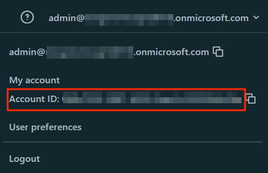

# voltage-spark-udf

To run this locally (ie, without Databricks) follow these steps.

First off, obviously `sbt clean assembly` to build and package the jar file. 

First, symlink the libvibesimplejava.so file located under the `./lib` folder of this repo to `/Volumes/voltage-integration/default/lib`, which is the path hard-coded in scala to support running this in a shared access mode cluster in Databricks. (Update the path as necessary for your symlink - this needs to be an absolute path and not relative.) Once you've done that, launch spark-shell making sure that you load the jar file.

```bash
sudo mkdir -p  /Volumes/voltage-integration/default/lib && sudo ln -s /home/mike/code/voltage-spark-udf/lib/libvibesimplejava.so /Volumes/voltage-integration/default/lib/libvibesimplejava.so

spark-shell --jars ./target/scala-2.12/com-contoso-udf-assembly-0.1.jar
```

Here's some sample code to encrypt data in spark using scala. There's a sample csv file under `data` in this repo. Again - update your path as necessary.

```scala
import com.contoso.voltageUDFs._

val clearTextDf = spark.read.format("csv").option("header","true").load("/home/mike/code/voltage-spark-udf/data/test.csv")

clearTextDf.show

val lowerCaseCryptoConfig = lit("LowerCaseAlphaNumeric|accounts22@dataprotection.voltage.com|voltage123")

clearTextDf
    .withColumn("firstname", encrypt(clearTextDf("firstname"), lowerCaseCryptoConfig))
    .withColumn("lastname", encrypt(clearTextDf("lastname"), lowerCaseCryptoConfig))
    .show
```

If you want to run in Databricks, you need to upload the `com-contoso-udf-assembly-0.1.jar` (this should end up under `./target/scala-2.12`) file as well as `vibesimplejava.jar` and `libvibesimplejava.so` which you can find under `./lib`.

You'll need to whitelist those 3 files in UC and also grant the appropriate permissions. I started some scripts to facilitate this - you can find those under `./databricks`. Use at your own risk. 

Note that all of the shell scripts assume that you are using Azure CLI authentication for the Databricks CLI. If you need to use PAT or Token authentication, refer to the Databricks CLI documentation.

The principals-permissions shell script creates account-level objects so you need to make sure that your .databrickscfg contains an "account profile." You can accomplish that by adding the following to your .databrickscfg file:

```bash
[ACCOUNT]
host = https://accounts.azuredatabricks.net/
account_id = xxxxxxxx-xxxx-xxxx-xxxx-xxxxxxxxxxxx
```
You can get your Databricks account id from the Account console (https://accounts.azuredatabricks.net/) by clicking on your user name in the top right.


